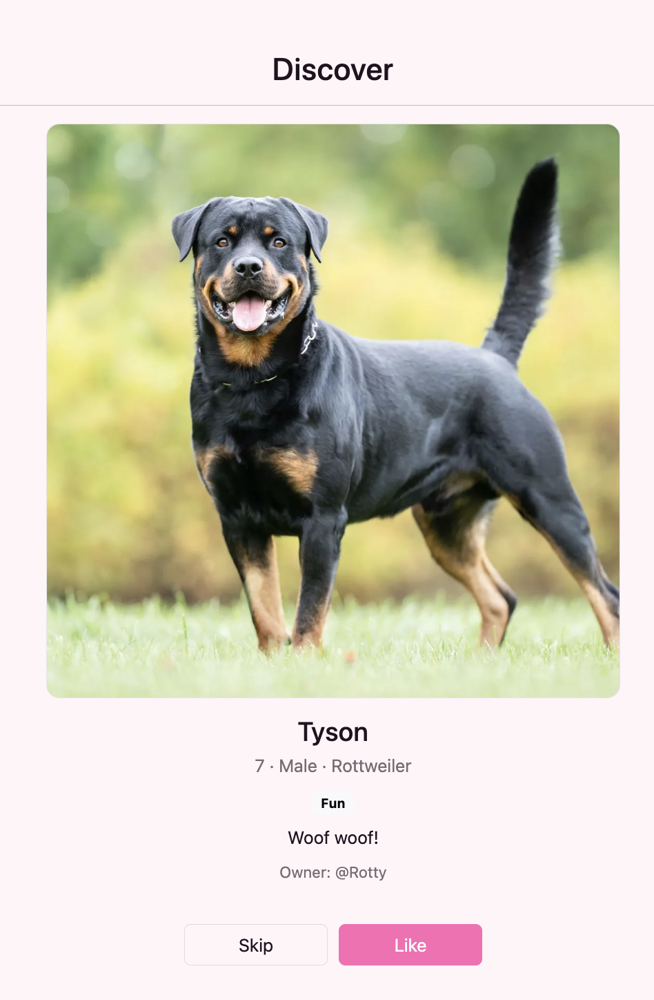
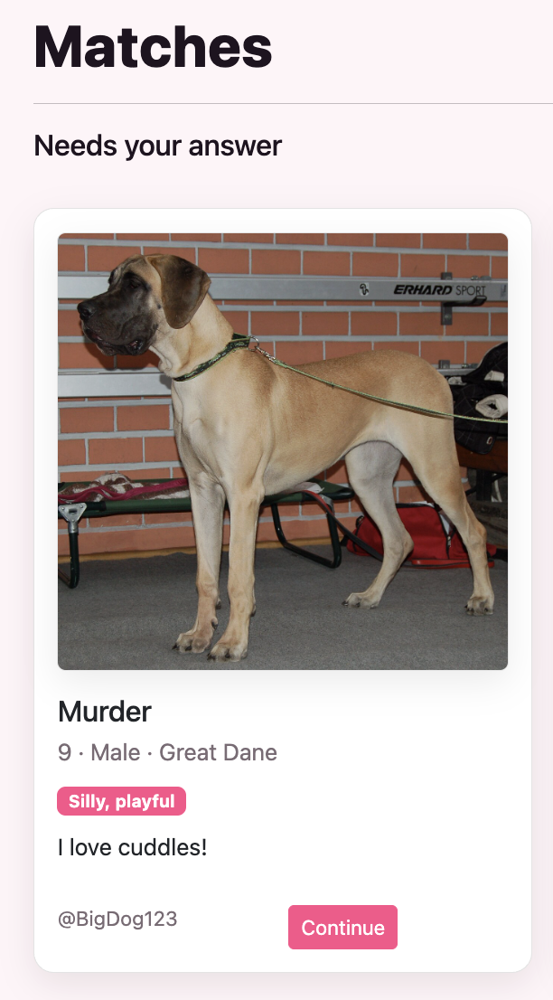

# Tindog - Tinder for Dogs!
# Created by Rishon Ghosh, Jagdeep Sidhu & Gurtej Gill

<div align="center">
  <h3>Website Snippet</h3>
  
  
  
  
</div>


## Overview
Tindog is a Tinder-inspired web app where users can sign up, create a profile for their own dog, and browse other potential partners for their dog. But there's a twist! Only dogs with similar musical preferences can match (you will be quizzed!). Users can click the button on the left side to like a dog, or click the button on the right to pass. Tindog is built using Python and Flask for the backend and HTML/CSS for the frontend.

## Features
- Individual user signup and login
- Password encryption built in through secure hash plugin 
- Add information about your dog, including an image
- Browse dogs one at a time
- Ability to like or dislike dogs
- Simple, clean, user-friendly user interface

## Tech Stack
* **Backend:** Python, Flask, Werkzeug
* **Database:** SQLite (Relational Data Management)
* **Frontend:** HTML, CSS, JavaScript (Jinja2 Templating)
* **Storage:** Local File System (Image & Audio Handling)

## Future Improvements
- Create swipe animations similar to Tinder
- Mobile version of web app
- Additional matching criteria and more specific reasoning

## Installation & Running Instructions

**Prerequisites:** Ensure you have **Python 3.x** installed on your machine.

**1. Clone the repository:**
```bash
git clone https://github.com/rishon-g/fallhacks-tindog.git
```
2. Set up a Virtual Environment (Recommended):
It is best practice to run this app in an isolated environment.

```bash
python3 -m venv venv
source venv/bin/activate  # On Mac/Linux
```

3. Install Dependencies:
Use the included requirements.txt to install all necessary packages automatically.

```bash
pip install -r requirements.txt
```
4. Start the Application:
Run the Flask server. The database will automatically initialize itself.

```bash
python3 app.py
```

5. View the App:
Open your web browser and navigate to:

```bash
http://127.0.0.1:5000
```
